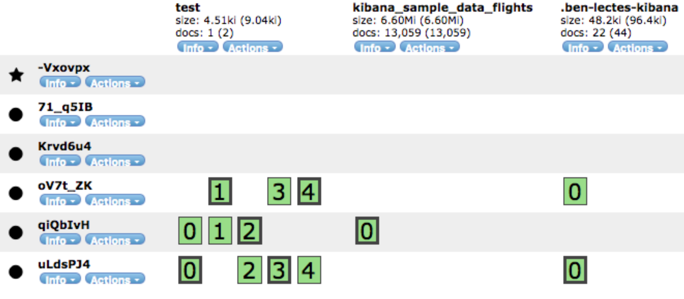

# Elasticsearch

- https://aspell.tistory.com/75
- https://esbook.kimjmin.net/06-text-analysis/6.1-indexing-data

## Elasticsearch 란?
1. Full-Text 검색 엔진
    - 대량의 데이터를 검색하기 위한 별도의 Index를 만드는 기술

1. 분석 엔진

1. 준 실시간 분석
    - 성능을 위해 데이터를 메모리에 유지
        + 노드가 죽으면 데이터 유실 가능
    - Split brain
        + 클러스터로 구성된 두 시스템 그룹간 네트워크의 일시적 동시 단절현상이 발생 시 나타나는 현상
        + 클러스터 상의 모든 노드들은 노드 각자가 자신을 primary(Master)라고 인식하게 되는 상황

## Inverted Index
#### 관계형 데이터베이스
| ID | Text |
|:---|:-----|
|doc1|The quick brown fox|
|doc2|The quick brown fox jumps over the lazy dog|
|doc3|The quick brown fox jumps over the quick dog|
|doc4|Brown fox brown dog|
|doc5|Lazy jumping dog|

- 'fox'가 들어간 문서를 찾기 위해 doc1 ~ doc5를 모두 검색

#### Elasticsearch
| Term | ID | Term | ID |
|:-----|:---|:-----|:---|
|The|doc1, doc2, doc3|quick|doc1, doc2, doc3|
|brown|doc1, doc2, doc3, doc4|fox|doc1, doc2, doc3, doc4|
|jumps|doc2, doc3|over|doc2, doc3|
|the|doc2, doc3|lazy|doc2|
|dog|doc2, doc3, doc4, doc5|Brown|doc4|
|Lazy|doc5|jumping|doc5|

- 추출된 각 키워드를 텀(Term) 이라 함
- fox를 포함하고 있는 문서를 바로 찾을 수 있음


## 구조
</img>
1. Cluster
    - {-Vxovpx, 71_q51B, Krvd6u4, oV7t_ZK, qiQbIvH, uLdsPJ4} 집합 
1. Node
    - 마스터 노드 : -Vxovpx, 71_q51B, Krvd6u4
    - 데이터 노드 : oV7t_ZK, qiQbIvH, uLdsPJ4

1. Index
    - test, kibana_sample_data_flights, .ben-lectes-kibana
    - 하나의 인덱스가 여러개의 데이터 노드에 저장

1. Document
    - test : 0, 1, 2, 3, 4
    - kibana_sample_data_flights : 0
    - .ben-lectes-kibana : 0

1. Shard
    - 원본 샤드 : test Index에서 oV7t_ZK Node의 1
    - 복제본 샤드 : test Index에서 qiQbIvH Node의 1
    - 원본 샤드가 유실되면 복제본 샤드가 원본 샤드로 승격
    - 원본 샤드에 대한 복제본 샤드가 다른 노드에 저장되어야 함
        + kibana_sample_data_flights의 경우  qiQbIvH 노드가 죽으면 0번 샤드를 복구할 수 없음

## 쿼리
| 관계형 | ES |
|:--------|:--------|
| select | GET |
| insert | POST |
| update | PUT |
| delete | DELETE |

1. Select
    - curl -XGET localhost:9200/index_name/doc_type/1
    - select * from doc_type where id = 1

1. Insert
    - curl -XPOST localhost:9200/index_name/doc_type/1 -d '{xxx}'
    - insert into index_name values {xxx}

1. Update
    - curl -XPUT localhost:9200/index_name/doc_type/1 -d '{xxx}'
    - update index_name set xxx where id = 1

1. Delete
    - curl -XDELETE localhost:9200/index_name/doc_type/1
    - delete from index_name where id = 1

## 실습
- curl -XGET http://localhost:9200/classes?pretty
    - classes 이름의 인덱스가 있는지 확인

- curl -XPUT http://localhost:9200/classes
    - classes 이름의 인덱스 생성

- curl -XDELETE http://localhost:9200/classes
    - classes 이름의 인덱스 삭제
    
- curl -XPOST http://localhost:9200/classes/class/1/ -d '{"title":"Algorithm", "professor":"Joh-Hn"}' -H 'Content-Type:application/json'
     + 5.5.0 이상 버전부터 헤더에 타입없으면 에러
     - -d 에 해당하는 다큐멘트 추가

- -H 'Content-Type:application/json' 안했을 때 오류
```json
{
  "error" : "Content-Type header [application/x-www-form-urlencoded] is not supported",
  "status" : 406
}

```

- curl -XPOST localhost:9200/classes/class/2/ -d @oneclass.json -H 'Content-Type:application/json'
    - 파일을 사용해서 다큐멘트 생성

### Update
- curl -XPOST localhost:9200/classes/class/2/_update?pretty -d '{"doc":{"major":"smartsystem"}}' -H 'Content-Type:application/json'
    - id = 2 인 다큐멘트에 "major":"smartsystem" 키, 벨류 추가
    - 그대로 curl -XPOST localhost:9200/classes/class/2/_update?pretty -d '{"doc":{"major":"Smart System Software"}}' -H 'Content-Type:application/json' 하면 major가 Smart System Software로 변경

- curl -XPOST localhost:9200/classes/class/2/_update?pretty -d '{"doc":{"unit":1}}' -H 'Content-Type:application/json'

- curl -XPOST localhost:9200/classes/class/2/_update?pretty -d '{"script":"ctx._source.unit += 5"}' -H 'Content-Type:application/json'
    - 스크립트로 변경

### Bulk
- curl -XPOST localhost:9200/_bulk?pretty --data-binary @classes.json -H 'Content-Type:application/json'
    - 벌크로 추가

- bulk 파일 구조
```json
{"index" : {"_index" : "iname", "_type" : "tname", "_id" : "1"}}
{"key1" : "value1", "key2" : "value2", "key3":"value3"}
```

- --data-binary 안했을 때 오류 -> 하는 기능, 이유 추가
```json
{
  "error" : {
    "root_cause" : [
      {
        "type" : "illegal_argument_exception",
        "reason" : "The bulk request must be terminated by a newline [\n]"
      }
    ],
    "type" : "illegal_argument_exception",
    "reason" : "The bulk request must be terminated by a newline [\n]"
  },
  "status" : 400
}

```

### Mapping
- curl -XPUT 'localhost:9200/classes/class/_mapping?pretty' -d @classesRating_mapping.json -H 'Content-Type:application/json'
    + 'string' type 삭제됨, 'text'로 바뀜

### Search
- _search 결과
```json
{
  "took": 5,  # 검색에 소요된 시간(ms)
  "_shard": {  # 샤드 정보
    "total": 2,
    "successful": 2,
    "failed": 0
  },
  "hits": {
    "total": 1,  # 결과 개수
    "max_score": 0.3708323,  # 검색 결과 중 가장 높은 스코어
    "hits": [# 검색 결과 상세
        {
          "_index" : "iname",
          "_type" : "tname",
          "_id" : "1",
          "_score" : 1.0, # 결과 점수
          "_source" : {
            "key1" : "value1",
            "key2" : "value2"
          }
        }, 
        {
            ...
            ...
        }
    ]  
  }
}
```

- curl -XGET localhost:9200/basketball/record/_search?pretty
    - 모든 다큐멘트 검색

- curl -XGET 'localhost:9200/basketball/record/_search?q=points:30&pretty'
    + URL을 '' 으로 감싸주지 않으면 오류남 &가 shell 명령으로 인식되는 것 같음
    - points 가 30인 다큐멘트를 검색

- curl -XGET 'localhost:9200/basketball/record/_search?pretty' -d '
{
    "query":{
        "term":{"points":30}
    }
}' -H 'Content-Type:application/json'
    - request body를 사용하여 검색

- request body 구조
```json

```

### Metric Aggregations (산술)
- curl -XGET localhost:9200/basketball/_search?pretty --data-binary @avg_points_aggs.json -H 'Content-Type:application/json'
```json
{
	"size" : 0,
	"aggs" : {
		"avg_score" : { # 어그리게이션 이름
			"avg" : { # 어그리게이션 타입
				"field" : "points" # 뭘로 어그리게이션 할건지
			}
		}
	}
}
```

### Bucket Aggregations (group by)
- curl -XGET localhost:9200/_search?pretty --data-binary @terms_aggs.json -H 'Content-Type:application/json'
- curl -XGET localhost:9200/_search?pretty --data-binary @stats_by_team.json -H 'Content-Type:application/json'

```json

{
    # terms_aggs.json
    "size" : 0, # 어그리게이션 결과만 보기위해서
    "aggs" : {
        "players" : {
            "terms" : {
                "field" : "team"
            }   
        }
    }
}

{
    # stats_by_team.json
    "size" : 0,
    "aggs" : {
        "team_stats" : {
            "terms" : {
                "field" : "team" # group by team
            },
            "aggs" : {
                "stats_score" : { as stats_score
                    "stats" : {
                        "field" : "points" # select stats(points)
                    }
                }
            }
        }
    }
}
```